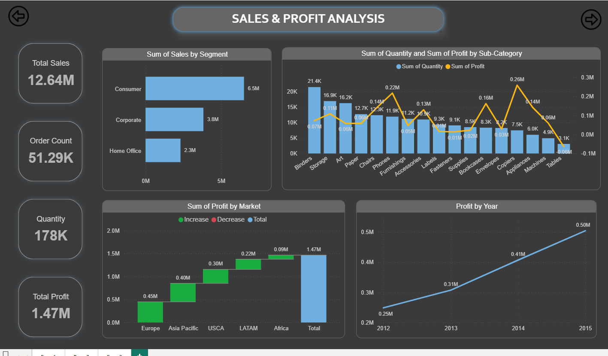

# Global Sales Analysis Power BI Project

## Overview

This Power BI project presents an interactive dashboard for global sales analysis, allowing users to explore sales, profits, orders, shipping, and customer insights across different regions and time periods.

## Key Features

- Sales and profit analysis by segment, sub-category, and market.
- Regional sales breakdown and profit trends.
- Shipping cost and order return analytics.
- Filter options by year, month, day, and country.

## Dashboard Preview

### Global Sales Analysis

### Sales & Profit Analysis

### Shipping Details
)

## Getting Started

1. Download and open the `.pbix` file in Power BI Desktop.
2. Use slicers to customize views by time and region.
3. Interact with charts for interactive insights.

## Requirements

- Power BI Desktop (latest recommended)
- Sample or organization-specific sales data (CSV/Excel/database)

## License

MIT License

---

Feel free to open an issue or discussion for questions, feedback, or contributions.
